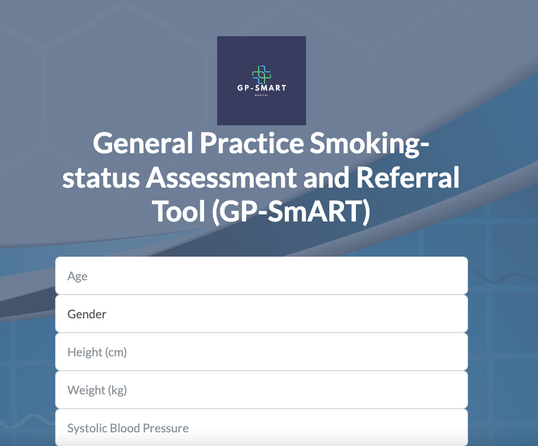
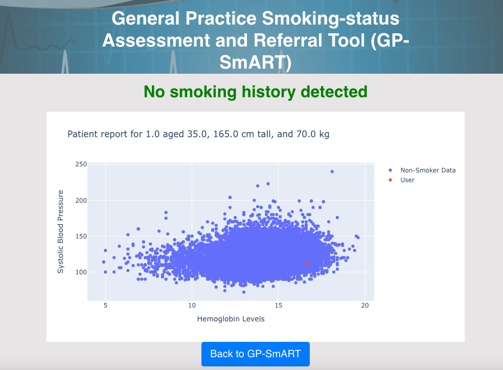
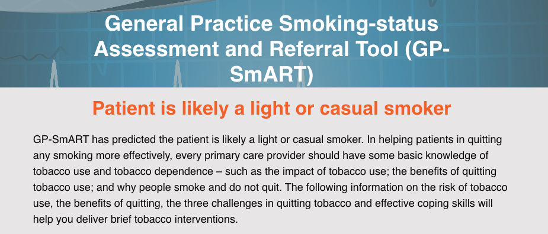
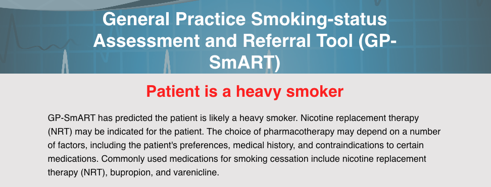
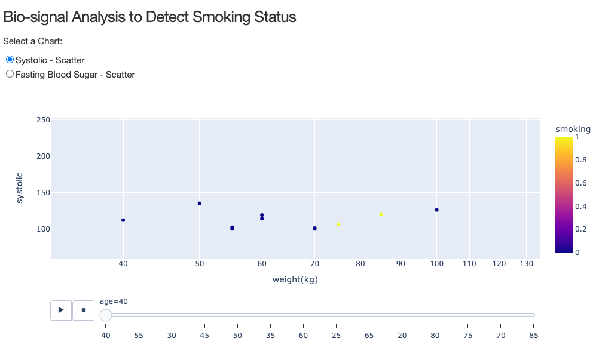
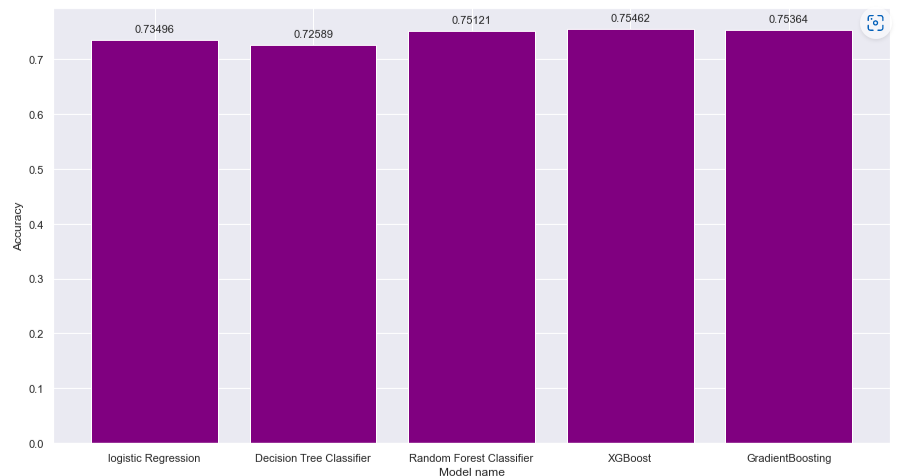

# General Practice Smoking Status Assessment and Referral Tool (GP-SmART)

## Access and Usage
- Create a new conda environment for this app with the following code:
```conda create -n smoking_env python=3.7```

- Activate this new environment before proceeding.
```conda activate smoking_env```

- Install the libraries into your new environment using pip packages listed in requirements file:
```pip install -r requirements.txt```

- Navigate to and run ```app.py``` and run the ```http://127.0.0.1:5000/``` hyperlink in your browser to access the local host server.

- To instantiate the model that predicts smoking status, run ```smoking5.ipynb``` in full before submitting a prediction. This will dump the model into a joblib file in the root directory.

## Overview
The code at ```app.py``` deploys a web-based screening tool that predicts the smoking status of patients in a primary healthcare setting. The application uses a gradient boosting machine learning algorithm that classifies input data into three categories: ```non-smoker``` , ```casual-smoker``` or ```heavy-smoker.```



Input features include: ```age```, ```gender```, ```height(cm)```, ```weight(cm)```, ```systolic blood pressure```, ```high-density lipoproteins(HDL)```, ```Hemoglobin```, ```triglyceride```,```serum creatinine```, ```gamma-glutamyl Transpeptidase (GTP)```

The ``non-smoker`` route presents a plotly patient report on the new patient data, and plots them relative to the rest of the non-smoking population.



The ```casual-smoker``` route returns best practice brief interventions, and behavioural techniques that can be used in the consultation.



The ```heavy-smoker``` route returns best practice pharmacotherapy options that can be prescribed to help with addiction nicotine. 



GP-SmART also contains a dash-built dashboard that allows the GP to explore the sample data and see where smokers and non-smokers are clustering on a range of different input variables.



## Pre-processing and model selection
- The notebook entitled ```smoking5.ipynb``` details the exploratory and pre-processing work done to the raw data in ```smoking.csv```

- Scaling was employed to the dataset to account for the various measurement scales present in the raw data.

- Accuracy testing revealed much higher f1 scores predicting '0's or 'non-smoking.' This has been found to be due to the lopsided nature of the data. For this reason, random_oversampling techniques were used.

- Several supervised machine learning algorithms were tested for accuracy as part of the pre-processing step. The relative accuracy is shown below.



### Please refer to: /TN-Folder/smoking5.ipynb for the Machine learning notebook code.


